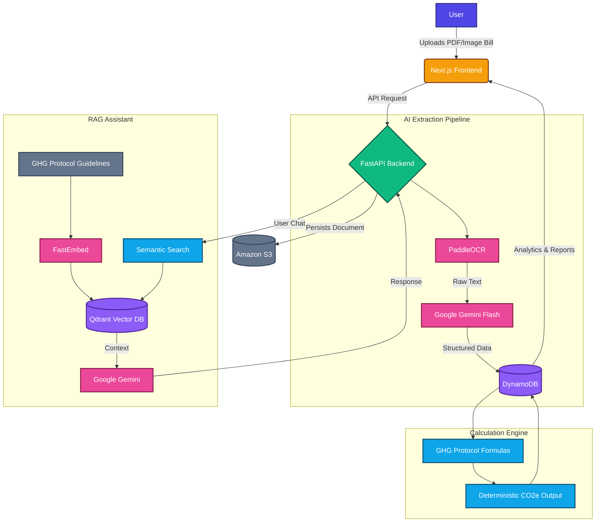

<div align="center">

# 🌍 Carbon Auditor

**AI-Powered Carbon Emission Intelligence Platform**

*Transforming unstructured utility bills into structured, actionable, and auditor-ready carbon intelligence.*

[](#)
[](https://www.python.org/)
[](https://nextjs.org/)
[](https://fastapi.tiangolo.com/)

[Explore the Docs](./docs/PRD.md) · [Report Bug](#) · [Request Feature](#)

</div>

---

## 📖 The Problem

Carbon emissions are generated through everyday activities—electricity consumption, gas, water, and fuel usage. Yet, most individuals and small organizations have no simple way to understand the carbon footprint hidden inside their utility bills and consumption records. 

Existing carbon calculators force users to:
- Manually enter consumption values.
- Understand and apply complex emission factors themselves.
- Interpret the final results without actionable insights.

Bills and invoices contain valuable information in unstructured formats, making manual data extraction slow and error-prone. **The problem is not just calculating carbon emissions—it's making carbon information automatic, understandable, personalized, and actionable.**

---

## 🚀 The Solution: Carbon Auditor

**Carbon Auditor** is an AI-powered cloud platform that converts everyday consumption bills into understandable carbon-emission intelligence. 

Instead of forcing users to manually calculate and interpret their footprint, Carbon Auditor creates an end-to-end automated workflow: 

**Upload ➡️ Extract ➡️ Calculate ➡️ Visualize ➡️ Report ➡️ Ask**

### 🌟 Key Features
- **🧠 AI-Powered Bill Intelligence:** Automatic extraction of consumption data from bills using PaddleOCR + Google Gemini.
- **📊 Personalized Carbon Intelligence:** Maintains a user's historical carbon profile and layers actionable insights on top of it.
- **💬 Conversational Sustainability Assistant:** A RAG-based AI assistant capable of answering ESG/compliance questions (e.g., *"Which activity contributes most to my emissions?"*).
- **🧮 Deterministic, Auditable Calculations:** AI extracts the data, but the math is 100% deterministic. Every emissions figure is traced to a fixed formula and a versioned GHG Protocol emission factor, making the output defensible to an auditor.
- **📑 Decision-Ready Reporting:** Generates detailed sustainability reports explaining the methodology, flagging data quality, identifying hotspots, and providing concrete reduction recommendations.

---

## 🎯 Who is this for?

| Segment | Need |
|---------|------|
| **🌱 Individuals** | Understand and track personal carbon footprint with ease. |
| **🎓 Educational Institutions** | Practical sustainability-awareness tooling for students. |
| **🏢 Small Businesses** | Begin monitoring operational emissions without needing a dedicated ESG team. |
| **🌍 Sustainability Teams** | Centralized consumption data, visual analytics, and automated reporting. |
| **🔍 Corporate Auditors** | Verify deterministic calculations against GHG Protocol standards reliably. |

---

## 🏗️ Architecture & Flow

Here is a high-level overview of how Carbon Auditor processes your data:



---

## 💻 Technology Stack

**Frontend**
- **Framework:** Next.js 14+ (App Router), React
- **Language:** TypeScript
- **Styling & UI:** Tailwind CSS, shadcn/ui, Recharts
- **State Management:** TanStack Query (React Query)
- **Hosting:** Vercel

**Backend**
- **Framework:** Python 3.11+, FastAPI
- **Architecture:** Containerized via Docker (Uvicorn behind Gunicorn)
- **Validation:** Pydantic v2
- **Background Jobs:** FastAPI `BackgroundTasks`

**AI & ML**
- **OCR:** PaddleOCR
- **LLM Extraction & Generation:** Google Gemini
- **Embeddings:** FastEmbed
- **Vector Database:** Qdrant Cloud

**Storage & Cloud Infrastructure**
- **Database:** Amazon DynamoDB
- **File Storage:** Amazon S3

---

## 🛠️ Setup & Installation Instructions

Follow these steps to set up Carbon Auditor locally for development.

### 1️⃣ Prerequisites
- **Node.js** `20.x` (LTS)
- **Python** `3.12.x`
- **pnpm** `9.x`
- **Docker** & **Docker Compose v2**
- API Keys for Google Gemini, Qdrant Cloud, and AWS Credentials.

### 2️⃣ Clone the Repository
```bash
git clone <repo-url> carbon-auditor 
cd carbon-auditor
```

### 3️⃣ Frontend Setup
```bash
corepack enable
corepack prepare pnpm@9 --activate
pnpm install
```

### 4️⃣ Backend Setup
```bash
cd backend
python3.11 -m venv .venv
# Activate the virtual environment:
# Mac/Linux: source .venv/bin/activate
# Windows: .venv\Scripts\activate
pip install -r requirements.txt -r requirements-dev.txt
cd ..
```

### 5️⃣ Environment Configuration
Copy the example environment files and fill in your keys:
```bash
cp backend/.env.example backend/.env
cp frontend/.env.example frontend/.env.local
```

### 6️⃣ Run the Application (Dockerized)
The easiest way to run the full stack (FastAPI, Next.js, and local DynamoDB) is via Docker Compose:
```bash
docker compose up --build
```
*Alternatively, you can run the backend and frontend separately outside of Docker. See `docs/TECH_STACK.md` for detailed individual commands.*

---

## 📜 License & Contribution

Currently in active development. Please refer to the documentation in `docs/` for contributing guidelines, PRDs, and detailed architectural specs.

*Built with ❤️ for a greener future.*
