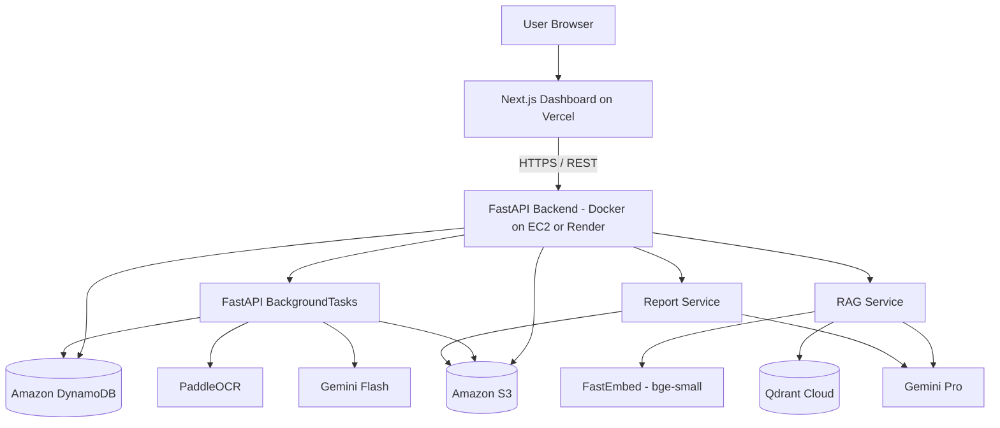

# Carbon Auditor — Product Requirements Document (PRD)
### AI-Powered Carbon Emission Intelligence Platform

**Version:** 3.0 (SDD-Ready — Zero-Ambiguity Spec for Autonomous-Agent Implementation)
**Status:** Active Development
**Document Owner:** Engineering Team

---

## 1. Executive Summary

Carbon Auditor is an AI-powered cloud platform that converts unstructured consumption bills (electricity, gas, water, fuel) into structured, actionable carbon-emission intelligence. It removes the manual overhead of ESG data collection by combining document intelligence (OCR + LLM extraction), a deterministic GHG Protocol-compliant calculation engine, historical analytics, and a conversational AI compliance assistant — all wrapped in a single dashboard, and closing the loop with a detailed, client-facing sustainability report.

This version of the PRD reflects two changes on top of the original architecture:

1. **A pivot away from AWS Lambda** for the core compute layer, because a PaddleOCR + FastEmbed + multi-step Gemini pipeline fights Lambda's execution-time, package-size, and cold-start constraints.
2. **A deliberately cost-conscious infrastructure choice for the hackathon phase.** The only AWS services in the stack are **Amazon S3** and **Amazon DynamoDB** — no Secrets Manager, no SQS, no App Runner. Everything else uses either free-tier-eligible AWS compute (EC2) or a free-tier PaaS (Render), with a clear, explicit upgrade path once the product needs to be marketed and paying customers justify additional spend.

> **Guiding principle:** Build this as if it will be sold to real sustainability teams — not as a one-off hackathon script — while keeping the running cost during the hackathon as close to $0 as possible. Every "skip this for now" decision below is paired with the exact upgrade path for when the product starts generating revenue.

---

## 2. Problem Statement

Carbon emissions are generated through everyday activities — electricity consumption, fuel usage, transportation, and other resource consumption. Most individuals and small organizations have no simple way to understand the carbon footprint hidden inside their bills and consumption records.

Existing carbon calculators require users to manually enter consumption values, understand emission factors, and interpret results themselves. Bills and invoices also contain valuable information in unstructured formats, making manual data extraction slow and error-prone.

**The problem is therefore not only calculating carbon emissions, but making carbon information automatic, understandable, personalized, and actionable.**

---

## 3. Proposed Solution

Carbon Auditor is an AI-powered cloud platform that converts everyday consumption bills into understandable carbon-emission intelligence.

Users upload bills or consumption documents to the platform. AI extracts the required information, structures the data, and applies the correct GHG Protocol emission factors to estimate associated carbon emissions — deterministically, never via an LLM guess.

The platform provides:
- Automated carbon-emission calculations
- Historical carbon-footprint tracking
- Interactive analytics and trends
- **AI-assisted, detailed sustainability reports with concrete reduction recommendations** (see §16)
- A personalized AI assistant (RAG-based) that answers ESG/compliance questions and questions about the user's own carbon data

Instead of forcing users to manually calculate and interpret their footprint, Carbon Auditor creates an end-to-end workflow: **Upload → Extract → Calculate → Visualize → Report → Ask.**

---

## 4. Innovation & Uniqueness

**AI-Powered Bill Intelligence** — Automatic extraction of consumption data from bills, eliminating manual entry.

**Personalized Carbon Intelligence** — Rather than a generic calculator, the platform maintains a user's historical carbon profile and layers insights on top of it.

**Conversational Sustainability Assistant** — Natural-language queries such as:
- "How much carbon did I generate this month?"
- "How has my footprint changed over time?"
- "Which activity contributes most to my emissions?"
- "What can I do to reduce my footprint?"
- "Does employee commuting fall under Scope 3?" (GHG Protocol compliance Q&A, grounded via RAG)

**Deterministic, Auditable Calculations** — AI never performs the math. Every emissions figure can be traced to a fixed formula and a versioned emission factor, making the output defensible to an auditor.

**Detailed, Decision-Ready Reporting** — Reports don't just state a number; they explain the methodology, flag data quality, identify emission hotspots, and give concrete, prioritized reduction recommendations (§16).

---

## 5. Target Users

| Segment | Need |
|---|---|
| **Individuals** | Understand and track personal carbon footprint |
| **Students & Educational Institutions** | Practical sustainability-awareness tooling |
| **Small Businesses** | Begin monitoring operational emissions without a dedicated ESG team |
| **Organizations & Sustainability Teams** | Centralized consumption data, analytics, and automated reporting |
| **Corporate Auditors** | Verify deterministic calculations against GHG Protocol standards |

### 5.1 In-Scope (MVP)

The MVP is exactly the following, no more:

- Single-user-per-company login (email + password, JWT session).
- Manual bill upload (PDF, PNG, JPEG/JPG) for **Electricity, Natural Gas, and Water** only.
- OCR + LLM structured extraction of the four fields defined in §14 (`utility_type`, `consumption`, `unit`, `cost`, billing period dates).
- Deterministic Scope 1/2/3 CO₂e calculation for the three utility types in §13, using the static factor table — no other utility types, no location-based or market-based factors.
- Dashboard: total CO₂e, MoM % change, Scope 1/2/3 breakdown chart, recent-bills table.
- RAG-based compliance chat scoped strictly to the pre-populated GHG Protocol knowledge base.
- Sustainability report generation per §16, for a single company, single date range, English only, PDF output.
- Single company/tenant per account — no cross-company sharing, no roles beyond "owner."

### 5.2 Out-of-Scope (MVP) — Explicit Exclusions

An autonomous agent implementing this spec **must not** build any of the following unless a future PRD revision explicitly moves them into §5.1:

- Multi-user accounts, roles/permissions, or team invitations of any kind.
- Multi-tenant / multi-company management under one login.
- SSO, OAuth social login, MFA, or password-reset-via-email flows (MVP password reset is out of scope entirely — no "forgot password" flow ships in MVP).
- JWT refresh tokens or "remember me" persistent sessions — a session simply expires after `ACCESS_TOKEN_EXPIRE_MINUTES` and the user logs in again.
- Any utility type other than Electricity, Natural Gas, and Water (e.g. fuel, transportation, refrigerants).
- Location-based (EPA eGRID) or market-based (REC) emission factors — static factors only (§13).
- Smart-meter/IoT ingestion, recurring/scheduled bill ingestion, or email-forwarding ingestion.
- Non-English bills or non-English chat/report output.
- Mobile app (iOS/Android) — web-responsive only.
- SQS, Redis, Secrets Manager, Cognito, or any paid AWS service beyond S3/DynamoDB/EC2 — see §22 for the exact ruled-out list.
- Editing or deleting historical `emissions` records once calculated (a bill can be re-processed, which supersedes the prior calculation, but there is no manual override UI for a raw CO₂e figure in MVP).
- Any Telegram/Google Sheets automation (mentioned only as a stretch goal in §7, not part of the buildable spec).
- Report formats other than PDF (no CSV/Excel export in MVP).
- Currency conversion or multi-currency support — MVP assumes a single currency configured per company at signup (see §28.4) and does not convert between currencies.

---

## 6. Critical Architecture Decisions (v2.1)

### 6.1 What Changed and Why

| Aspect | v1.0 (Original) | v2.1 (Current) | Reason for Change |
|---|---|---|---|
| Compute (backend) | AWS Lambda (FastAPI + Mangum) | **Containerized FastAPI service (Docker)** | Lambda's 29s timeout and 250MB package limit fight directly against PaddleOCR, FastEmbed, and multi-step Gemini pipelines. Cold starts hurt live-demo reliability. |
| Backend hosting | AWS Lambda + API Gateway | **Amazon EC2 (Free Tier)** — primary; **Render (Free/Starter tier)** — alternative | Keeps cost at $0 during the hackathon. See §9.4 for the full comparison, including why **AWS App Runner was intentionally ruled out**. |
| Frontend | Static SPA on S3 + CloudFront | **Next.js (React)** | Matches the team's existing stack, gives a much faster path to a polished dashboard. |
| Frontend hosting | S3 + CloudFront | **Vercel (Free/Hobby tier)** | Zero-config CI/CD, PR previews, free for this scale. |
| Database | DynamoDB | **DynamoDB (unchanged)** | Explicit requirement — retained, and it's already free-tier friendly (on-demand mode). |
| File storage | S3 | **S3 (unchanged)** | Explicit requirement — retained. |
| Secrets management | AWS Secrets Manager | **Environment variables** (`.env` on EC2 / Render's built-in encrypted env-var store / GitHub Actions Secrets for CI) | Secrets Manager costs ~$0.40/secret/month with no free tier. At hackathon scale, correctly-scoped environment variables are secure enough and cost nothing. See §12 and §20 for the exact handling rules. |
| Async job handling | Implicit (forced by Lambda's timeout) | **In-process background tasks (FastAPI `BackgroundTasks`)**, with DynamoDB itself doubling as the job-status store | No SQS needed at hackathon volume — SQS is optional, added later purely for scale (see §9.3). |

### 6.2 What This Unlocks
- **No Lambda cold-start cliff** for PaddleOCR/FastEmbed — models load once when the container starts and stay warm for the life of the instance.
- **A genuinely $0 AWS bill** for the hackathon phase: only S3 and DynamoDB are used, both of which stay inside AWS's free tier at this scale.
- **WebSocket / Server-Sent Events (SSE)** become viable for real-time processing status and chat streaming — not possible cleanly behind API Gateway + Lambda.
- Easier local development: `docker-compose up` runs the entire backend identically to production, on EC2, or (with minor tweaks) on Render.

### 6.3 Existing Codebase & Reusable Assets (v1)

A v1 implementation already exists from the original AWS Lambda-based build and is retained in the project repository/folder as a reference and integration base — it is **not being thrown away and rebuilt from zero**:

- **OCR pipeline** — a working, partially-built implementation of the PaddleOCR → Gemini Flash extraction flow described in §14 already exists.
- **RAG pipeline** — a working, partially-built implementation of the FastEmbed → Qdrant Cloud → Gemini retrieval/synthesis flow described in §15 already exists.

Neither is complete, and both were originally written against the Lambda/Mangum runtime. When development resumes (including AI-assisted development, e.g. via Antigravity — see §6.4), the correct approach is:

1. Treat the existing `ocr_service.py`/`rag_service.py` logic as the starting implementation for the same-named services in the new `backend/app/services/` structure (§8.2, §9), not as throwaway prototypes.
2. Strip the Mangum/Lambda-handler wrapping and re-home the logic inside the persistent FastAPI app described in this document.
3. Validate each against the current spec in §14 and §15 (schema fields, retry counts, thresholds) before treating it as done — some details may have drifted from this PRD during earlier experimentation.
4. Carry over any already-tuned prompts (Gemini Flash extraction prompt, RAG synthesis prompt) as a first draft, then re-test against the golden test sets described in §19.

### 6.4 Development Approach — Antigravity

Going forward, implementation work on this project is done with **Antigravity** (AI-assisted/agentic development) rather than fully manual coding. This PRD is written to be the single authoritative source document for that process:
- Every architectural decision states both the *what* and the *why*, so implementation can proceed directly from this document without needing clarification from a prior conversation.
- Section numbers are stable cross-references (e.g. "§14", "§16.11") used throughout the document specifically so that generated code, prompts, or follow-up questions can point back to an exact requirement.
- §6.3 above exists so that Antigravity (or any developer) picking up this project knows to look for and reuse the existing v1 OCR/RAG code rather than regenerating it from scratch.

---

## 7. High-Level System Components

1. **On-Demand Bill Processing** — Upload, OCR extraction (PaddleOCR + Gemini Flash), structured storage.
2. **Carbon Calculation Engine** — Deterministic scope classification, emission-factor application, CO₂e aggregation.
3. **RAG Knowledge Engine** — Interactive querying over GHG Protocol guidelines via FastEmbed + Qdrant Cloud + Gemini.
4. **Dashboard (Next.js)** — Visual analytics, reporting, bill management, AI chat.
5. **Reporting Module** — Detailed, client-ready sustainability report generation with recommendations (§16).
6. **Automation System** *(stretch goal, may be maintained separately)* — Scheduled report generation, Telegram notifications, Google Sheets sync.

---

## 8. Technology Stack

### 8.1 Frontend

| Layer | Technology | Notes |
|---|---|---|
| Framework | **Next.js 14+ (App Router)** | SSR + client components, file-based routing |
| Language | **TypeScript** | Type safety across the app |
| Styling | **Tailwind CSS** | Matches design tokens in §10 |
| UI Components | **shadcn/ui** (Radix-based) | Accessible, unstyled-first primitives that fit Tailwind |
| Charts | **Recharts** | Scope 1/2/3 breakdowns, monthly trend lines |
| State/Data fetching | **TanStack Query (React Query)** | Caching, polling for async job status, optimistic UI |
| Forms & Validation | **React Hook Form + Zod** | Bill-detail editing, auth forms |
| Auth (client) | JWT stored in **HttpOnly cookies** | Avoids `localStorage` XSS exposure noted as a risk in the original security doc |
| Hosting | **Vercel (Free/Hobby tier)** | Zero-config CI/CD, PR previews, edge network, $0 cost at this scale |

### 8.2 Backend

| Layer | Technology | Notes |
|---|---|---|
| Language | **Python 3.11+** | |
| Framework | **FastAPI** | Unchanged from v1.0 — architecture below is preserved |
| Server | **Uvicorn workers behind Gunicorn** | Replaces Mangum; runs as a persistent process |
| Containerization | **Docker + Docker Compose** | Single image, deployable identically on EC2 or Render |
| Validation | **Pydantic v2** | Request/response schemas, `BaseSettings` for config |
| Background jobs | **FastAPI `BackgroundTasks`** for OCR/report generation at hackathon scale (see §9.3 for the scale-up path) | Zero extra infrastructure, zero extra cost |
| Dependency Injection | FastAPI's native `Depends()` | Unchanged |

### 8.3 Data & Storage

| Layer | Technology | Notes |
|---|---|---|
| Primary database | **Amazon DynamoDB** (on-demand capacity) | Tables: `users`, `bills`, `emissions`, `settings` (see §11). Also doubles as the async-job status store — no separate queue table needed. |
| File storage | **Amazon S3** | Raw bill uploads, generated PDF reports |
| Vector database | **Qdrant Cloud (Free/Serverless tier)** | Pre-populated GHG Protocol embeddings |
| Cache (optional, future) | Amazon ElastiCache (Redis) or DynamoDB Accelerator (DAX) | Only worth adding once traffic and dashboard-query volume justify it |

### 8.4 AI / ML

| Component | Technology | Notes |
|---|---|---|
| OCR | **PaddleOCR** | Raw text extraction from bill images |
| PDF → Image | `pdf2image` (Poppler) | Converts uploaded PDFs before OCR |
| Document understanding | **Gemini Flash** | Structures raw OCR text into strict JSON schema |
| RAG synthesis | **Gemini Pro** | Answers compliance questions from retrieved context |
| Report narrative generation | **Gemini Pro** | Turns deterministic numbers into plain-language findings + recommendations (never computes numbers itself — see §16) |
| Embeddings | **BAAI/bge-small-en-v1.5** via **FastEmbed** | Query + corpus embeddings for Qdrant |
| Calculation engine | **Pure Python, deterministic** | No AI/LLM involvement — GHG Protocol math only (unchanged, and non-negotiable) |

### 8.5 Auth & Security

| Layer | Technology | Notes |
|---|---|---|
| Auth | **JWT (HS256)**, issued by backend | v1.0 approach retained for speed; Cognito remains a documented future upgrade (§24) |
| Secrets | **Environment variables**, injected via `.env` on EC2 (root-owned, `chmod 600`, never committed) or via Render's built-in encrypted environment-variable dashboard | Deliberately avoids the recurring per-secret cost of AWS Secrets Manager while the app is pre-revenue |
| Transport security | TLS 1.2/1.3 everywhere — Vercel provides this by default; on EC2, terminate TLS with **Nginx + Let's Encrypt (Certbot, free)**; Render provides it by default | |
| IAM | An IAM user/role with permissions scoped only to the specific S3 bucket and DynamoDB tables used (`s3:GetObject`/`PutObject`, `dynamodb:*` scoped to `carbon-*` tables) | Even without Secrets Manager, least-privilege IAM still applies to the S3/DynamoDB credentials themselves |

### 8.6 DevOps & Observability

| Layer | Technology | Notes |
|---|---|---|
| Version control | **GitHub** | Monorepo or split `frontend/` + `backend/` repos |
| CI/CD (backend) | **GitHub Actions** → build Docker image → `docker pull` + restart on EC2 via SSH deploy step, **or** auto-deploy on push if using Render | No container registry cost — image can be built directly on the host, or pushed to Docker Hub's free tier if a registry is wanted |
| CI/CD (frontend) | **Vercel Git integration** (automatic on push) | |
| Logging | Local structured JSON logs on EC2 (rotated with `logrotate`), or **Render's built-in log viewer** | CloudWatch is a fine future upgrade once the AWS footprint grows, but isn't required at this stage |
| Monitoring/alerts | **UptimeRobot (free tier)** for uptime pings + optional **Sentry (free tier)** for error tracking | Both have generous always-free tiers and add real "production-mindset" credibility for judges |
| IaC (recommended, later) | **Terraform** or **AWS CDK** | Worth introducing once infrastructure moves beyond a single EC2 box |

---

## 9. System Architecture

### 9.1 Component Diagram

### 9.2 Request Flow — Bill Upload

1. User uploads a bill via the Next.js dashboard.
2. FastAPI validates the file, stores it in `S3: carbon-storage`, and writes a `bill` record with status `PENDING` to DynamoDB.
3. FastAPI schedules the OCR job as a **`BackgroundTask`** on the same request/response cycle and immediately returns `202 Accepted` with the `bill_id` to the frontend — the request thread is not blocked.
4. The background task runs PaddleOCR → Gemini Flash → Pydantic validation, updates the `bill` record's `status` field in DynamoDB (`PROCESSING` → `COMPLETED`/`FAILED`), and writes the calculated emissions.
5. The frontend polls `GET /api/v1/bills/{id}` (via React Query, e.g. every 2–3 seconds while `status` is not terminal) and renders the result once `status = COMPLETED`.

> This keeps the API responsive without needing a message broker. The trade-off — a background task dies if the process restarts mid-job — is acceptable at hackathon/early-pilot volume and is explicitly called out as the first thing to harden in §9.3 once real usage starts.

### 9.3 Async Processing: Free-Tier Approach Now, Scale-Up Path Later

The team does not want to take on any paid infrastructure until the product is being marketed. Here is the honest trade-off table:

| Approach | Cost | Reliability | When to use |
|---|---|---|---|
| **FastAPI `BackgroundTasks`** *(Recommended for hackathon)* | $0 — no extra infrastructure | Job is lost if the process crashes/restarts mid-task; no automatic retries | Hackathon demo and early pilot — the volume of concurrent uploads is low and predictable |
| **DynamoDB-as-a-queue** (a `status: PENDING` item + a lightweight polling loop in a second thread/process) | $0 — reuses the DynamoDB table you already have | Slightly more resilient than pure in-memory tasks (job state survives a process restart); still self-built, no dead-letter handling | If you want a bit more resilience than `BackgroundTasks` without adding any new AWS service |
| **Amazon SQS** | Actually **free at this scale** — AWS SQS's free tier (1 million requests/month) is a standing, permanent free tier, not a 12-month trial | Proper retry, visibility timeout, and Dead Letter Queue support out of the box | Worth adding once you want production-grade retry semantics — it's free even before you're marketing the product, so this is a good "cheap insurance" upgrade if time allows |
| **Redis + RQ/Celery** (e.g. Upstash's free Redis tier) | $0 on Upstash's free tier | Full task queue semantics, but adds a new moving part and a new vendor | Only if you outgrow DynamoDB-as-a-queue and don't want to add SQS |

**Recommendation:** Ship with `BackgroundTasks` for the hackathon. If there's spare time before the demo, upgrade to SQS specifically because its free tier is permanent and it directly restores the Dead-Letter-Queue behavior described in the original error-handling doc — it's the one "paid-sounding" AWS service that is not actually going to cost anything at this scale.

### 9.4 Backend Hosting Options (Decision Needed — Recommendation Provided)

> **Note on AWS App Runner:** App Runner was considered in an earlier draft of this PRD but has been **ruled out**. It has no free tier at all (billed per vCPU-hour and GB-hour from the first second), and as of mid-2026 AWS has stopped onboarding new customers to it, recommending **Amazon ECS Express Mode** as its replacement. ECS Express Mode is Fargate-based and also has no free tier. Neither fits a "stay free until we're marketing this" requirement.

| Option | Cost | Pros | Cons | Verdict |
|---|---|---|---|---|
| **Amazon EC2** *(Recommended)* | **$0** for 12 months on a new AWS account (Free Tier: 750 hrs/month of `t2.micro`/`t3.micro`), then a few dollars/month after | Always-on (no cold starts), full control over the Docker environment, runs the API + OCR worker + Nginx on one box, easiest to reason about for a live demo | You own OS patching and basic ops; `t2.micro`/`t3.micro` has only 1 GB RAM, which is tight for PaddleOCR — plan to either use swap space or size up to `t3.small` (still cheap, ~$15/month, only needed once free-tier hours run out) | **Primary choice** for the hackathon — genuinely free, and reliable for a live judged demo |
| **Render** | Free tier exists, but: spins down after ~15 minutes of inactivity (cold start of 30–60s on the next request) and caps free web services at 512 MB RAM / 0.1 vCPU | Fastest possible setup, automatic HTTPS, git-push deploys, no server management at all | 512 MB RAM is likely too tight for PaddleOCR + FastEmbed running together; the free tier's spin-down behavior is risky during a live judged demo unless you upgrade to the Starter plan (~$7/month) for judging day | **Good alternative** if the team prioritizes setup speed over $0 cost — budget for the ~$7/month Starter plan at least during the demo window if resource limits are hit on the free tier |
| **Railway** | Free trial credit (time-limited, not a standing free tier) | Very fast setup, good DX, similar to Render | Trial credit runs out; not a long-term free option | Only as a short-term fallback if both EC2 and Render hit snags close to deadline |
| **EC2 self-managed vs. everything else** | — | Maximum control, no vendor lock-in beyond AWS itself | Requires comfort with basic Linux/Docker ops (already assumed given the team's background) | — |

**Recommendation:** Deploy the FastAPI container (API + background OCR/report tasks, all in one process for now) to a single **EC2 `t3.micro`/`t3.small`** instance behind **Nginx** (reverse proxy + Let's Encrypt TLS). Keep **Render** as the fallback if EC2 setup takes too long before the deadline — just budget for its paid Starter tier if you go that route, since the free tier's cold starts and RAM ceiling are real risks for a live demo with PaddleOCR in the loop.

### 9.5 Frontend Hosting

**Vercel (Free/Hobby tier)** — zero-config Next.js deploys, PR previews, global edge CDN, $0 at this scale. No change from the previous recommendation; nothing about the backend cost decisions affects this.

---

## 10. Design System (Frontend)

**Strict monochrome (black & white) theme.** No brand color — every surface, state, and chart uses black, white, and a grayscale ramp between them. This is a deliberate design choice (a clean, confident, "audit-grade" feel that suits a compliance product) and applies to every screen, including charts and the generated report itself.

### 10.1 Color Tokens

| Token | Value | Usage |
|---|---|---|
| `--ink` | `#0A0A0A` | Primary text, primary buttons, headings |
| `--ink-secondary` | `#404040` | Secondary text, icons |
| `--muted` | `#737373` | Placeholder text, disabled states, captions |
| `--background` | `#FFFFFF` | Page background |
| `--surface` | `#FAFAFA` | Cards, panels — distinguished from the background by a `1px solid var(--border)` outline rather than a colored shadow |
| `--border` | `#E5E5E5` | Card borders, table dividers, input outlines |
| `--border-strong` | `#0A0A0A` | Focus rings, active/selected states |
| `--surface-inverse` | `#0A0A0A` | Dark surfaces (e.g. the sidebar), with `#FFFFFF` text on top |

**No color is used for semantic state (error/success/warning).** Instead:
- **Errors** are communicated with an icon (✕ or ⚠), bold/heavier text weight, and a subtly tinted gray box (`#F0F0F0`) with a `1px solid var(--ink)` border — never red.
- **Success** is communicated with a checkmark icon and the same neutral tinted-box pattern.
- Charts (Scope 1/2/3 breakdown, monthly trend) use a grayscale scale — `#0A0A0A`, `#404040`, `#737373`, `#A3A3A3` — plus distinct fill patterns (solid, striped, dotted) where a chart needs more than 3–4 series, so information isn't lost for colorblind users or when the report is printed/exported in black-and-white.

### 10.2 Typography

- **Primary font: `Geist Sans`** (Vercel's typeface) — a clean, modern, monochrome-friendly grotesque that pairs naturally with the Next.js + Vercel hosting stack (§8.1, §9.5) and loads easily via `next/font`.
- **Data/numeric font: `Geist Mono`** — used specifically for tabular numbers (CO₂e figures, dates, bill amounts) so figures align cleanly in tables and stat cards, reinforcing the "audit-grade precision" feel.
- **Fallback stack:** `Inter, system-ui, -apple-system, sans-serif` if Geist isn't available in a given build environment.
- **Hierarchy:** H1 `2rem` / H2 `1.5rem` / H3 `1.125rem` / Body `1rem` / Caption `0.875rem` — all in `--ink`, with `--ink-secondary` for de-emphasized body copy.

### 10.3 Surfaces & Motion
- Flat design — borders instead of colored shadows; if a shadow is used at all, keep it neutral and extremely subtle (`box-shadow: 0 1px 2px rgba(0,0,0,0.04)`).
- Subtle micro-interactions (150–200ms ease-in-out on hovers/focus), skeleton loaders (grayscale shimmer) for data fetches.
- **Accessibility:** WCAG 2.1 AA — with no color-coded semantics, contrast ratio compliance is easier to guarantee, but icon + text labeling for every state (never icon or color alone) is mandatory. `aria-label`s on all interactive elements, logical tab order.

### Pages
- Auth (Login/Register)
- Dashboard (stat cards, Scope 1/2/3 chart, recent bills table)
- Upload Bill (drag-and-drop, progress, OCR status)
- Bill Details (split view: document viewer + editable extracted-data form)
- AI Compliance Chat (markdown-rendered responses, source citations)
- **Reports** (generate, preview, and download the detailed sustainability report — see §16)
- Settings (company profile, emission-factor region if enabled)

---

## 11. Data Model (DynamoDB)

| Table | Partition Key | Sort Key | Purpose | Notes |
|---|---|---|---|---|
| `carbon-users` | `user_id` | — | Auth + role data | |
| `carbon-bills` | `company_id` | `bill_id` | Structured bill + extraction status | Status enum: `PENDING`, `PROCESSING`, `COMPLETED`, `FAILED_OCR_QUALITY`, `FAILED`. Also acts as the async job-status store (§9.3). |
| `carbon-emissions` | `company_id` | `emission_date` | Calculated CO₂e records | GSI: `ScopeIndex` for scope-based queries |
| `carbon-settings` | `company_id` | — | Company-specific configuration | Region, reporting year, REC/market-based override flags |

**Retention/lifecycle:** Raw bill files in S3 can move to Glacier after a configurable period (e.g., 12 months) to control storage cost — carried forward from the original inventory doc.

---

## 12. Authentication & Security

- JWT (HS256) issued on login; **stored in an HttpOnly, Secure cookie** (upgrade from the original `localStorage` approach, closing the XSS risk flagged in the original security doc).
- All secured endpoints require `Authorization: Bearer <token>` (or the cookie, depending on final client implementation) validated by FastAPI middleware.
- **Secrets handling (updated):** `GEMINI_API_KEY`, `QDRANT_API_KEY`, `QDRANT_URL`, and `JWT_SECRET` are stored as plain environment variables — in a root-owned `.env` file with `chmod 600` on the EC2 instance (or in Render's encrypted environment-variable dashboard), and as encrypted **GitHub Actions Secrets** for CI. They are never committed to version control (`.env` stays in `.gitignore`). This is a deliberate, documented trade-off versus AWS Secrets Manager to avoid its per-secret monthly cost while pre-revenue; rotating to Secrets Manager later is a one-line config change (§24).
- IAM credentials used by the backend to talk to S3/DynamoDB are scoped to only the specific bucket and tables in use — least privilege still applies even without Secrets Manager in the picture.
- Encryption at rest (DynamoDB default SSE, S3 SSE-S3) and in transit (TLS 1.2/1.3 via Nginx/Let's Encrypt or the hosting platform's default) throughout.
- Dependency scanning: `pip-audit` / GitHub Dependabot in CI.
- SAST: `bandit` for Python in CI pipeline.

---

## 13. Carbon Calculation Engine (Unchanged — Non-Negotiable Rule)

> **No AI or LLM is permitted to perform carbon calculations.** All math is deterministic Python, based on GHG Protocol emission factors.

**Formula:** `Emissions (kg CO₂e) = Consumption × Emission Factor`

| Utility Type | Scope | Category | Dev Factor |
|---|---|---|---|
| Electricity (US avg) | Scope 2 | Purchased Electricity | 0.385 kg CO₂e / kWh |
| Natural Gas | Scope 1 | Stationary Combustion | 5.3 kg CO₂e / Therm |
| Water | Scope 3 | Purchased Goods & Services | 0.344 kg CO₂e / 1000 Gallons |

**Error handling:** negative consumption → `InvalidConsumptionError`; unknown utility type → `UnsupportedUtilityTypeError`; unit mismatch → attempt conversion, else `UnitMismatchError` + flag for manual review.

**Future upgrade path:** location-based factors via EPA eGRID (by zip code), market-based factors with REC support (100% renewable purchase → 0 kg CO₂e override).

---

## 14. OCR & Document Understanding Pipeline (Universal Converter)

The pipeline has been upgraded to support a universal document ingestion system using **Microsoft MarkItDown**. It converts any uploaded document (PDF of any length, Excel, PPTX, DOCX, images) into Markdown for downstream processing.

1. **MarkItDown** converts the uploaded file into raw Markdown (or CSV/JSON representation for `.xlsx`). There is no page limit.
2. The raw Markdown is cached/stored for later ingestion into the RAG Knowledge Engine.
3. **Gemini Flash** structures the resulting Markdown text into a strict JSON schema (`utility_type`, `consumption`, `unit`, `cost`, billing period dates).
4. Pydantic validates the output; malformed JSON triggers up to **2 retries** with an appended correction prompt.
5. If MarkItDown extracts fewer than 20 words (e.g. empty document or poorly scanned image), the pipeline aborts early with `FAILED_OCR_QUALITY` to save LLM cost.
6. Temporary files are deleted at the end of each background task.

Because the backend runs as a **long-lived container**, MarkItDown processes files locally without requiring a heavy ML model like PaddleOCR, drastically reducing memory footprint while expanding file format support.

---

## 15. RAG Knowledge Engine (Unchanged)

- **Embedding model:** `BAAI/bge-small-en-v1.5` via FastEmbed.
- **Vector DB:** Qdrant Cloud Serverless (Ingestion pipeline provided via `backend/scripts/ingest_knowledge.py` to populate GHG Protocol documents from `backend/data/ghg_protocol_docs`).
- **Retrieval:** Top-K (default 5) cosine-similarity search; similarity threshold (~0.70) short-circuits to a fallback response to prevent hallucination.
- **Synthesis:** Gemini Pro, strictly grounded in retrieved context, with a refusal behavior for off-topic queries.
- **Failure handling:** Qdrant timeout → 500 with a clear message; Gemini rate limit → exponential backoff (≤3 retries) then 429.

---

## 16. Sustainability Report — Content & Structure Specification (New)

This is the client-facing deliverable of the whole platform, so it needs to read like a real ESG report, not a raw data dump. It is generated by the **Report Service**: deterministic numbers come straight from the Carbon Calculation Engine and DynamoDB; only the narrative explanation and recommendation text are generated by an LLM (Gemini Pro), grounded strictly in those pre-computed numbers — the LLM is never allowed to invent or adjust a figure.

Based on common structures used in real corporate carbon/ESG reports (GHG Protocol-aligned disclosures, CDP-style reporting, and SECR-style UK reporting), each generated report should include:

### 16.1 Cover & Executive Summary
- Company/organization name, reporting period (e.g. calendar year or custom range), and generation date.
- One-paragraph, plain-language summary: total emissions (CO₂e), how that compares to the prior period (% change), and the single biggest driver of the footprint.

### 16.2 Reporting Boundary & Methodology
- **Organizational boundary:** which entity/site(s) the report covers (even for a single-site SMB, state this explicitly — it's the single most common gap called out in real audits).
- **Operational boundary:** confirms Scope 1, 2, and 3 categories included (per GHG Protocol).
- **Methodology statement:** "Emissions calculated per the GHG Protocol Corporate Standard using [list of emission factors and their source/year]."
- **Data source disclosure:** which figures came from OCR-extracted bills vs. manual entry, and a call-out of any estimated (rather than directly measured) values — real reports are penalized for silently mixing the two.

### 16.3 Total Emissions Summary
- Total CO₂e for the period, in metric tons.
- Period-over-period trend (month-over-month and/or year-over-year), shown as both a number and a chart.

### 16.4 Scope 1 / 2 / 3 Breakdown
- Table + chart of emissions by scope, with the category label (e.g. "Scope 1 — Stationary Combustion", "Scope 2 — Purchased Electricity", "Scope 3 — Purchased Goods & Services (Water)").
- Percentage contribution of each scope to the total.

### 16.5 Emissions by Source / Utility Type
- Breakdown by utility type (electricity, gas, water, etc.), tying back to the specific bills that fed each figure (link/reference to `bill_id`s for traceability).

### 16.6 Monthly/Quarterly Trend
- Time-series view of total emissions and per-scope emissions across the reporting period, to show trajectory, not just a snapshot.

### 16.7 Emission Hotspot Identification
- Automatically ranks the top 2–3 contributing categories or utility types.
- This section directly drives §16.8 — recommendations should map onto the hotspots identified here, not be generic boilerplate.

### 16.8 Reduction Recommendations (AI-Generated Narrative, Numbers-Grounded)
Concrete, prioritized, and tied to the user's actual hotspots — not generic advice. Categories to draw from, matched to what the data shows:
- **Energy efficiency:** LED retrofits, HVAC scheduling/upgrades, equipment maintenance — when electricity is the top driver.
- **Procurement changes:** switching to renewable energy tariffs or purchasing **Renewable Energy Certificates (RECs)** to zero out Scope 2 under a market-based method (ties directly to the existing "Future Production Upgrades" note in the calculation engine spec).
- **Behavioral/operational changes:** reducing idle-time consumption, water-use policies — when Scope 3/water is significant.
- **Supplier/value-chain engagement:** for Scope 3 categories beyond what's currently modeled, note that structured supplier engagement is the standard next step as the platform matures.
- **Target-setting guidance:** suggest aligning future reduction goals with **Science-Based Targets (SBTi)** and common milestones (e.g., Net Zero by 2050, or an earlier interim target), without claiming certification the platform doesn't provide.

Each recommendation in the generated text should state: *what* to do, *why* (tied to the specific hotspot number), and a *rough expected impact* framed qualitatively (e.g., "switching this facility's electricity to a certified renewable tariff would eliminate the largest single line item in this report's Scope 2 total") rather than a fabricated precise percentage.

### 16.9 Data Quality & Limitations Disclosure
- Explicit statement of which values are OCR-extracted vs. manually entered vs. estimated/defaulted.
- Notes any known limitations (e.g., "location-based grid factors not yet applied; using US national average") so the report doesn't overstate its own precision — this is what makes a report defensible rather than something that falls apart under a second look.

### 16.10 Appendix
- Full bill-level data table (date, utility type, consumption, unit, cost, calculated CO₂e, source `bill_id`).
- Emission factor reference table with source/version, so numbers can be reproduced or challenged.

### 16.11 Technical Implementation Notes
- New backend module: `services/report_service.py`.
- Report generation flow: pull the period's `emissions`/`bills` records from DynamoDB → run hotspot ranking (deterministic Python) → build a structured prompt containing only the computed numbers and hotspot ranking → call Gemini Pro to write §16.1, §16.8, and connective narrative text in the surrounding sections → assemble the full document (numbers + narrative) → render to PDF (e.g. via `WeasyPrint` or `reportlab`) → store in `S3: carbon-storage/reports/` → return a signed download URL.
- New endpoint: `POST /api/v1/reports/generate` (body: `{ "period_start": ..., "period_end": ... }`) → `202 Accepted` with a `report_id`, following the same async pattern as bill uploads (§9.2–9.3).
- **Guardrail:** the prompt sent to Gemini explicitly instructs it to use only the numbers provided and to never state a CO₂e figure that wasn't given to it — mirroring the RAG service's "don't invent information" rule (§15).

---

## 17. API Overview

Base path: `/api/v1/`. Standard response envelope (`status`, `data` / `code`, `message`, `details`).

| Endpoint | Method | Purpose |
|---|---|---|
| `/auth/login` | POST | Authenticate, issue JWT |
| `/bills/upload` | POST | Upload bill (multipart), returns `bill_id`, processing runs in the background |
| `/bills/{bill_id}` | GET | Fetch extraction + emissions result (also used for status polling) |
| `/bills` | GET *(new)* | List bills for the authenticated company, paginated per §28.3 (`limit`, `cursor` query params; default page size 20, sorted by `upload_date` descending) |
| `/emissions/summary` | GET | Dashboard aggregate (Scope 1/2/3, trend) |
| `/chat/query` | POST | RAG compliance Q&A |
| `/reports/generate` | POST *(new)* | Generate the detailed sustainability report described in §16 |
| `/reports/{report_id}` | GET *(new)* | Fetch report status / signed download URL |

Full request/response payloads and error-code tables are preserved from the original API specification and response-examples documents and remain valid under the new runtime (no schema changes required by the architecture pivot).

---

## 18. Error Handling Strategy (Unchanged Principles)

- Custom domain exceptions (`AuthenticationError`, `AuthorizationError`, `ResourceNotFoundError`, `ValidationProcessingError`, `OCRProcessingError`, etc.) inheriting from a common `CarbonBaseException`, caught by a single global FastAPI exception handler.
- Frontend: global fetch/axios interceptor — 401 clears session and redirects to login; 500 shows a generic toast; 400 field-level errors map to form inputs.
- Structured JSON logging, rotated locally (`logrotate`) on EC2 or viewed via Render's dashboard.
- Failed background jobs (OCR or report generation) update the DynamoDB record to `FAILED` with an `error_message` field rather than silently disappearing — the closest free-tier equivalent of the Dead-Letter-Queue behavior described in the original doc. If/when SQS is adopted (§9.3), its native DLQ replaces this pattern.

---

## 19. Testing Strategy (Unchanged, Reaffirmed)

- **Backend:** `pytest`; 100% coverage target on `calc_engine.py` (deterministic, so fully testable); `moto` for mocked AWS services (S3, DynamoDB) in integration tests; `unittest.mock` for external APIs (Gemini, Qdrant) in unit tests.
- **Frontend:** Jest + Testing Library for units/components; Playwright for E2E (login → upload → dashboard update → chat query → report generation).
- **AI-specific:** a 20-sample "golden set" of raw OCR texts for prompt-regression testing; a 50-question RAG evaluation set for retrieval accuracy; spot-checks that report recommendations never cite a number absent from the input data.
- **CI gatekeeping:** GitHub Actions blocks merges on lint failure, test failure, or coverage <80%.
- **Security:** `bandit` SAST in CI; load testing (Artillery/Locust) simulating concurrent users before major releases.

---

## 20. Coding Standards (Unchanged)

- **Python:** `black` (line length 88), `flake8`, `mypy`; mandatory type hints; Google-style docstrings; `snake_case`/`PascalCase`/`UPPER_SNAKE_CASE` conventions.
- **Frontend:** `Prettier` + `ESLint`; `const`-by-default; `async/await` over `.then()` chains.
- **Git:** Conventional Commits; `type/issue-number-short-desc` branch naming; PRs require ≥1 approval and passing CI; no direct commits to `main`.

---

## 21. Environment Variables (Updated)

| Variable | Scope | Notes |
|---|---|---|
| `ENVIRONMENT` | Global | `development` / `production` |
| `AWS_REGION` | Global | e.g. `us-east-1` |
| `JWT_SECRET`, `JWT_ALGORITHM`, `ACCESS_TOKEN_EXPIRE_MINUTES` | Auth | Plain environment variable — see §12 for storage rules |
| `GEMINI_API_KEY` | AI | Plain environment variable — see §12 |
| `QDRANT_API_KEY`, `QDRANT_URL` | AI | Plain environment variable — see §12 |
| `S3_UPLOAD_BUCKET`, `DYNAMO_TABLE_USERS`, `DYNAMO_TABLE_BILLS`, `DYNAMO_TABLE_EMISSIONS` | Data | Resource identifiers |
| `AWS_ACCESS_KEY_ID`, `AWS_SECRET_ACCESS_KEY` | Data | Scoped IAM user credentials for S3/DynamoDB access (only needed if not using an EC2 instance role — an instance role is preferred when running on EC2, since it avoids storing static keys at all) |
| `NEXT_PUBLIC_API_BASE_URL` | Frontend | Points Next.js at the backend's public URL (EC2 Elastic IP + domain, or Render's URL) |

`.env` files are never committed; local dev uses `.env` + `docker-compose`, tests use `.env.test` with `moto`-mocked AWS resources.

> **Tip:** On EC2, prefer attaching an **IAM instance role** (with S3/DynamoDB permissions scoped to the `carbon-*` resources) over storing `AWS_ACCESS_KEY_ID`/`AWS_SECRET_ACCESS_KEY` as environment variables at all — it's free, more secure, and removes one more secret to manage.

---
## 23. Non-Functional Requirements

| Category | Requirement |
|---|---|
| **Availability** | Target 99.5% uptime for the API tier during the hackathon judging window and beyond |
| **Performance** | Dashboard summary loads < 1.5s (p95); bill upload acknowledgment < 500ms; OCR job completion communicated within an estimated SLA shown to the user |
| **Scalability** | Single EC2 instance is sufficient for hackathon/pilot volume; horizontal scaling (multiple instances behind a load balancer, or a move to ECS) is the documented next step once traffic grows |
| **Cost efficiency** | $0 AWS spend during the hackathon phase by design; every paid upgrade in this document is explicitly deferred until the product is being marketed |
| **Auditability** | Every emissions figure traceable to a specific formula version + factor value used at calculation time; every report recommendation traceable to a specific computed hotspot |
| **Data privacy** | Company data logically isolated by `company_id` partition key across all tables |

---

## 24. Risks & Assumptions

### Assumptions
- Uploaded bills are in common formats (PDF, PNG, JPEG) with legible typography.
- GHG Protocol guidelines remain relatively static for the current engine version.
- A single EC2 `t3.micro`/`t3.small` instance can handle the OCR + API load expected during the hackathon and early pilot phase.

### Risks & Mitigations
| Risk | Mitigation |
|---|---|
| OCR inaccuracies on poor-quality scans | Human-in-the-loop verification/edit step already in the Bill Details UI |
| `t3.micro`'s 1 GB RAM is tight for PaddleOCR + FastEmbed running together | Add a swap file as a free mitigation; upgrade to `t3.small` (still cheap) if needed before the demo |
| Background task lost on process crash/restart (no retry) | Acceptable at current volume; documented upgrade path to SQS (free tier) or DynamoDB-as-a-queue in §9.3 |
| Gemini/Qdrant third-party rate limits or outages during judging | Exponential backoff + a clearly-messaged fallback response rather than a hard failure |
| Report recommendations drifting from the actual computed numbers | Strict prompt guardrails (§16.11) + a test asserting no report cites a number absent from its input data |
| New team members unfamiliar with container-based deploys vs. Lambda | This PRD + a short `README`/runbook documenting `docker-compose up` and the EC2/Render deploy steps |

---

## 25. Roadmap / Future Enhancements (Paid Upgrades, Deferred Until Marketing Begins)

- **Secrets:** migrate from plain environment variables to **AWS Secrets Manager** once the extra ~$0.40/secret/month is justified by real customers.
- **Async processing:** adopt **Amazon SQS** (still free at moderate scale) for proper retries/DLQ; consider **ECS Fargate** or a multi-instance EC2 setup behind a load balancer if traffic outgrows a single box.
- **Auth:** migrate from custom JWT to **AWS Cognito** for enterprise-grade auth (SSO, MFA) as the customer base grows.
- **Emission factors:** location-based (zip-code → EPA eGRID) and market-based (REC) emission factors.
- **Data ingestion:** smart-meter / IoT ingestion for continuous consumption data (bypassing manual bill uploads entirely).
- **Analytics:** predictive consumption/emission forecasting.
- **Multi-tenancy:** organization-level, multi-user dashboards with role-based access control.
- **Database:** migration path from DynamoDB to Aurora PostgreSQL if relational reporting queries become complex.
- **Security hardening:** VPC-isolated backend + AWS WAF in front of the load balancer/CloudFront once there's a customer base whose risk profile justifies it.

---

## 26. Success Metrics (Hackathon + Early Product)

| Metric | Target |
|---|---|
| End-to-end demo (upload → extraction → emissions → dashboard → chat → report) | Fully functional live, no manual data entry, $0 infrastructure cost |
| OCR extraction accuracy on test bill set | ≥ 90% field-level accuracy on the golden test set |
| RAG answer relevance on the 50-question eval set | ≥ 85% judged-correct |
| API p95 latency (non-OCR endpoints) | < 500ms |
| Test coverage (backend) | ≥ 80%, 100% on `calc_engine.py` |
| Generated report | Includes all 10 sections from §16 with no fabricated numbers |

---

## 27. Summary of Key Decisions to Communicate to Judges/Stakeholders

1. **We deliberately moved off AWS Lambda** for the core compute layer because our AI/OCR pipeline (PaddleOCR + FastEmbed + multi-step Gemini calls) was fighting Lambda's timeout and package-size limits — not because Lambda is bad in general, but because it was the wrong tool for this specific workload.
2. **We kept the infrastructure deliberately minimal and free**: only S3 and DynamoDB from AWS, a free-tier EC2 instance (or Render) for compute, and free tiers of Vercel and Qdrant Cloud everywhere else — every dollar of spend is deferred until the product is actually being marketed.
3. **We explicitly evaluated and ruled out AWS App Runner** — it has no free tier and is being phased out for new customers, so it wasn't a fit even before considering cost.
4. **We chose Next.js on Vercel** for the dashboard because it matches modern product-engineering practice, ships fast, and gives us PR previews and edge delivery for free.
5. **The carbon math stays 100% deterministic** — AI is used only where it adds value (reading messy documents, answering compliance questions, writing up findings in plain language), never for the numbers that go into a compliance report.
6. **The client-facing report is a first-class deliverable**, not an afterthought — it follows the structure real GHG Protocol-aligned corporate carbon reports use (boundary/methodology disclosure, scope breakdown, hotspot identification, grounded recommendations, data-quality disclosure), which is what makes it credible to an actual sustainability team.

---

## 28. Explicit Constraints & Disambiguations (SDD Addendum)

Every item below closes a gap that was previously implicit, unspecified, or inconsistent across the source documents this PRD consolidates. An implementing agent should treat every value here as a hard constraint, not a suggestion — if a different value is truly needed, that is a PRD change, not an implementation-time judgment call.

### 28.1 Authentication & Session Rules
- Passwords are hashed with **bcrypt** (cost factor 12) via `passlib`. Plaintext passwords are never logged or stored.
- Minimum password length: **8 characters**. No other complexity rule in MVP (matches §8.1 client-side validation).
- JWT: `HS256`, expiry = `ACCESS_TOKEN_EXPIRE_MINUTES` (default `60`). No refresh tokens (§5.2). On expiry, the frontend's 401 interceptor (§18) clears the session cookie and redirects to `/login` — this is the entire "session expired" UX, no toast or warning beforehand.
- One user record maps to exactly one `company_id` in MVP (no user belongs to multiple companies).

#### 28.2 File Upload Constraints
- Accepted formats: `PDF`, `PNG`, `JPEG`, `XLSX`, `CSV`, `DOCX`, `PPTX` (and anything supported by MarkItDown). Unsupported types will gracefully fail during parsing.
- **Maximum file size: 15 MB.** Larger files are rejected at the API layer with `400 Bad Request` and message `"File exceeds the 15MB upload limit."` - this prevents the free-tier server from running out of memory (OOM) when parsing large documents.
- **Length limitation:** Removed. PDFs and Excel files are processed in their entirety using MarkItDown, assuming they fit within the 15MB limit.
- Duplicate uploads (same file re-uploaded) are **not deduplicated** — each upload creates a new, independent `bill_id`. Deduplication is out of scope (§5.2).

### 28.3 Pagination & List Defaults
- `GET /api/v1/bills` (list endpoint — see §17 addition below) defaults to **page size 20**, sorted by `upload_date` descending, using `limit`/`cursor` query params (DynamoDB-native pagination token, not offset-based).
- The dashboard's "Recent Bills" table (§10 Pages) always shows the **5 most recent** regardless of the list endpoint's default page size.

### 28.4 Currency & Units
- Each company sets **one currency code** (ISO 4217, e.g. `USD`, `INR`) once, at signup, stored in `carbon-settings`. All `cost` fields for that company are in that currency. There is no per-bill currency override and no conversion between currencies (§5.2).
- All consumption units follow §14/§13 exactly: `kWh` (Electricity), `Therms` (Natural Gas), `Gallons` (Water). Any other unit string returned by extraction triggers `UnitMismatchError` (§13) — there is no silent best-effort conversion beyond what §13 already defines.
- All monetary and emissions figures are rounded to **2 decimal places** at the point of calculation and storage — not just at display time — so stored values and displayed values are always identical.

### 28.5 Dates & Time Zones
- All dates/timestamps are stored and transmitted as **UTC, ISO 8601** (`YYYY-MM-DDTHH:mm:ssZ` for timestamps, `YYYY-MM-DD` for billing-period dates). The frontend converts to the viewer's local time zone for display only.
- A report's `period_start` must be strictly before `period_end`; equal or reversed dates → `400 Bad Request`. Maximum report period in MVP: **366 days**.

### 28.6 RAG `confidence_score` — Exact Definition
The `confidence_score` field shown in §17's chat response (carried over from the original API examples) was previously unspecified. It is defined as: **the cosine similarity score (0.0–1.0) of the single highest-ranked retrieved chunk, rounded to 2 decimal places.** This is the same score compared against the 0.70 threshold in §15 — the threshold check and the returned `confidence_score` must always use the identical value, never two separately computed numbers.

### 28.7 Concurrency & Idempotency
- A given `bill_id` can only be processed once at a time — if a second `/bills/{id}` re-process request arrives while `status = PROCESSING`, return `409 Conflict` rather than queuing a duplicate background task.
- Report generation for the same `company_id` + identical `period_start`/`period_end` while a prior request is still `PROCESSING` also returns `409 Conflict`.

### 28.8 Localization
- All UI text, chat responses, and generated reports are **English only** in MVP (§5.2). No i18n framework is required yet, but no hardcoded strings should assume a specific currency symbol beyond what §28.4 configures.

---

## 29. User Stories & Binary Acceptance Criteria

Each story below has pass/fail criteria only — no subjective judgment calls. An agent (or human reviewer) should be able to check every box mechanically.

### US-1 — User logs in
**As a** company user, **I want to** log in with email/password **so that** I can access my dashboard.
- [ ] `POST /auth/login` with correct credentials returns `200` and a JWT.
- [ ] `POST /auth/login` with incorrect password returns `401` with the exact error shape from §17/§18.
- [ ] `POST /auth/login` with a malformed email returns `400` before any database lookup occurs.
- [ ] A valid JWT grants access to any `Authorization`-protected route; an expired or missing JWT returns `401` on all of them, no exceptions.

### US-2 — User uploads a bill
**As a** company user, **I want to** upload a utility bill **so that** its emissions are calculated automatically.
- [ ] Uploading a valid file (PDF/Excel/Word/PPT/Image) under 15MB returns `202 Accepted` with a `bill_id` in under 500ms.
- [ ] Uploading a file over 15MB returns `400` and the file is never written to S3.
- [ ] Uploading an unsupported file type (e.g. `.exe`) returns `400` and no background task is scheduled.
- [ ] Within the pipeline's expected processing window, `GET /bills/{id}` eventually returns `status: COMPLETED` with non-null `extracted_data` and `emissions`, OR `status: FAILED`/`FAILED_OCR_QUALITY` with a non-null `error_message` — it is never left in `PENDING`/`PROCESSING` indefinitely without a terminal state being reachable.

### US-3 — User views the dashboard
**As a** company user, **I want to** see my total emissions and breakdown **so that** I understand my footprint at a glance.
- [ ] `GET /emissions/summary` returns a total CO₂e figure that exactly equals the sum of all `COMPLETED` bills' `calculated_co2e_kg` for that company and period.
- [ ] The Scope 1/2/3 breakdown percentages sum to 100% (± 0.1% rounding tolerance).
- [ ] A company with zero completed bills gets the documented empty-state UI (§10 Pages), not an error or a blank screen.

### US-4 — User asks the AI compliance assistant a question
**As a** company user, **I want to** ask a GHG Protocol question **so that** I get a grounded, cited answer.
- [ ] A query whose top retrieval score ≥ 0.70 returns an `answer` plus a non-empty `sources` array (§28.6).
- [ ] A query whose top retrieval score < 0.70 returns the exact fallback message defined in §15/§16 wording, with an empty `sources` array — never a hallucinated answer.
- [ ] The returned `confidence_score` exactly matches the top retrieval score used for the threshold check (§28.6) — never a different, separately-computed number.

### US-5 — User generates a sustainability report
**As a** company user, **I want to** generate a report for a date range **so that** I have a client-ready document.
- [ ] `POST /reports/generate` with `period_start < period_end` and a range ≤ 366 days returns `202 Accepted` with a `report_id`.
- [ ] `POST /reports/generate` with `period_start >= period_end` returns `400` without scheduling any work.
- [ ] The completed report (fetched via `GET /reports/{id}`) contains all 10 sections listed in §16.1–§16.10, in order.
- [ ] Every CO₂e figure appearing anywhere in the report's narrative text (§16.8 recommendations included) exactly matches a number that was present in the structured data passed into the report-generation prompt — an automated test must assert this for every generated report in the test suite (§19).

### US-6 — Calculation engine correctness (non-negotiable core)
**As the** platform, **I must** never let AI compute an emissions figure.
- [ ] For every one of the three supported utility types, `calc_engine.py` produces the exact expected `kg CO2e` value (consumption × factor, rounded to 2 decimals) for a fixed set of golden test inputs — 100% test coverage, zero tolerance for deviation.
- [ ] Negative consumption input raises `InvalidConsumptionError` and never reaches the database.
- [ ] An unrecognized `utility_type` raises `UnsupportedUtilityTypeError` and never silently defaults to any factor.

---

*This document supersedes and consolidates all prior individual specification files (Project Overview, AWS Infrastructure, API Specification, IAM & Security, Frontend Requirements, Backend Architecture, RAG Architecture, OCR & Bill Processing, Carbon Calculation Engine, Error Handling, Deployment Guide, Coding Standards, Testing Strategy, API Response Examples, Environment Variables, AWS Resource Inventory) into a single source of truth. Section numbers in this document are stable identifiers — cross-references such as "§14" or "§16.11" point to a fixed section and should be treated as authoritative anchors by any downstream document (`TECH_STACK.md`, `DESIGN.md`, `TASKS.md`, or an agent workspace config) generated from this PRD.*

### Architectural Principle
- **Modular Code:** All code must be highly modular. Avoid monolithic single-file structures by isolating logic into appropriate modules and services.
