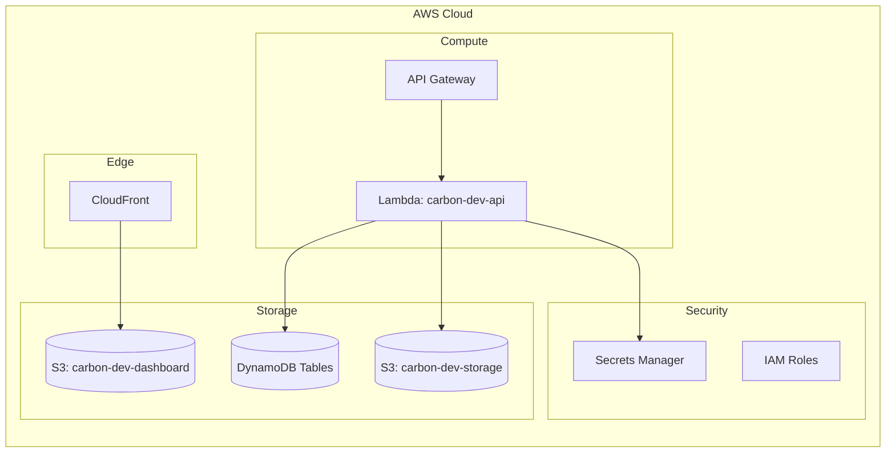

# Carbon-Auditor: AWS Infrastructure

## 1. Purpose

This document outlines the AWS cloud infrastructure required to deploy, run, and scale the Carbon-Auditor platform. It details specific services, naming conventions, configurations, and IAM requirements, strictly adhering to a serverless, AWS Free Tier-optimized architecture.

## 2. Naming Conventions

To ensure consistency and prevent resource collision, all AWS resources must follow this naming convention:
`carbon-dev-<resource-type>-<purpose>` or `carbon-dev-<name>`

**Examples:**
* S3 Bucket: `carbon-dev-uploads`
* Lambda Function: `carbon-dev-api`
* DynamoDB Table: `carbon-dev-users`
* IAM Role: `carbon-dev-lambda-execution-role`

## 3. Resource Inventory

### 3.1. Compute & API
* **Amazon API Gateway**
  * **Name**: `carbon-dev-apigw`
  * **Type**: HTTP API (or REST API if specific request validation is required).
  * **Purpose**: Routes external HTTPS traffic to the FastAPI Lambda function.
* **AWS Lambda**
  * **Name**: `carbon-dev-api`
  * **Runtime**: Python 3.10+
  * **Purpose**: Hosts the FastAPI application via Mangum wrapper. Handles all business logic, OCR invocation, Calculation Engine, and RAG coordination.
  * **Memory**: 1024 MB (due to PaddleOCR and FastEmbed requirements).
  * **Timeout**: 29 seconds (bounded by API Gateway limit).

### 3.2. Storage
* **Amazon S3 (Data)**
  * **Name**: `carbon-dev-storage`
  * **Purpose**: Stores uploaded utility bills, generated reports, and temporary processing files.
* **Amazon S3 (Frontend)**
  * **Name**: `carbon-dev-dashboard`
  * **Purpose**: Hosts static frontend assets (HTML, CSS, JS).

### 3.3. Database
* **Amazon DynamoDB**
  * **Tables**: `carbon-dev-users`, `carbon-dev-bills`, `carbon-dev-emissions`, `carbon-dev-settings`.
  * **Capacity Mode**: On-Demand (to stay within Free Tier scaling limits without manual provisioning).
  * **Purpose**: Primary transactional database for the system.

### 3.4. Content Delivery
* **Amazon CloudFront**
  * **Name**: `carbon-dev-distribution`
  * **Purpose**: Serves the frontend application securely globally with HTTPS, caching static assets from the `carbon-dev-dashboard` S3 bucket.

### 3.5. Security & Monitoring
* **AWS IAM**
  * **Roles**: Custom execution roles enforcing least privilege (detailed in `07_IAM_and_Security.md`).
* **AWS Secrets Manager**
  * **Name**: `carbon-dev-secrets`
  * **Purpose**: Securely stores Gemini API keys, JWT secrets, and Qdrant Cloud API keys.
* **Amazon CloudWatch**
  * **Name**: Log groups matching the Lambda function names (`/aws/lambda/carbon-dev-api`).
  * **Purpose**: Centralized logging and metric monitoring.

## 4. Infrastructure Architecture Diagram

## 5. Deployment Considerations

* **Infrastructure as Code (IaC)**: While manual setup is possible, using AWS SAM (Serverless Application Model) or AWS CDK is highly recommended for reproducibility.
* **Free Tier Management**: Monitor DynamoDB read/write capacity units and API Gateway requests via AWS Billing Alarms to ensure they remain within the Free Tier limits.

## 6. Future Production Upgrade Notes

* **VPC Integration**: Move Lambda functions inside a custom VPC with private subnets for enhanced security.
* **WAF (Web Application Firewall)**: Attach AWS WAF to CloudFront and API Gateway to protect against common web exploits and DDoS attacks.
* **RDS Migration**: If data relationships become complex, migrate DynamoDB workloads to Amazon RDS (Aurora PostgreSQL), which will require VPC configuration and NAT Gateways.
