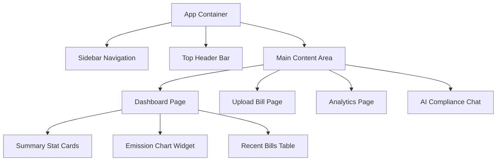

# Carbon-Auditor: Frontend Requirements

## 1. Purpose

This document details the precise requirements for the Carbon-Auditor Frontend. It serves as the master specification for UI development, outlining components, pages, states, and API integrations. The output of this document is intended to be directly actionable by the Antigravity UI Builder.

## 2. Overview & Tech Stack

* **Architecture**: Static Single Page Application (SPA).
* **Core Tech**: HTML5, Vanilla CSS3 (or TailwindCSS if requested), Vanilla JavaScript (ES6+) or React (if framework required).
* **Hosting**: Amazon S3 + CloudFront.
* **Design Philosophy**: Professional, Enterprise-grade, Clean, Accessible (WCAG 2.1 AA), and Responsive (Mobile-first to Desktop).

## 3. Global UI Guidelines

* **Color Palette**:
  * Primary: Deep Forest Green (`#1E3F20`)
  * Secondary: Emerald Green (`#2E7D32`)
  * Background: Off-White/Light Gray (`#F5F7FA`)
  * Surface: White (`#FFFFFF`) with subtle shadow (`box-shadow: 0 4px 6px rgba(0,0,0,0.05)`)
  * Text: Dark Charcoal (`#333333`)
  * Error: Crimson Red (`#D32F2F`)
* **Typography**: Inter or Roboto (Google Fonts). Standardized hierarchy (H1: 2rem, H2: 1.5rem, Body: 1rem).
* **Animations**: Subtle micro-interactions. (e.g., 200ms ease-in-out on button hovers, skeleton loaders for data fetches).

## 4. Component Hierarchy

## 5. Page Specifications

### 5.1. Authentication (Login/Register)
* **Components**: Card layout centered vertically/horizontally. Form inputs (Email, Password). Submit button.
* **Validation**: Client-side email regex, password minimum length (8 chars).
* **API Integration**: POST `/api/v1/auth/login`. On success, store JWT and redirect to `/dashboard`.
* **States**: Normal, Loading (spinner in button), Error (red text below inputs).

### 5.2. Main Dashboard (`/dashboard`)
* **Layout**: Left sidebar for navigation, top bar for user profile/settings, main content area.
* **Components**:
  * **Stat Cards**: Total CO₂e (MT), MoM % Change, Total Bills Processed.
  * **Charts**: Bar chart displaying Scope 1 vs Scope 2 vs Scope 3 emissions (using Chart.js or Recharts).
  * **Recent Activity Table**: Columns (Date, Utility Type, Status, Calculated CO₂e).

### 5.3. Upload Bill (`/upload`)
* **Components**: Drag-and-drop zone. "Browse Files" button.
* **Interactions**: Drag enter/leave CSS changes. Progress bar during upload.
* **API Integration**: POST `/api/v1/bills/upload` (FormData).
* **States**:
  * Empty: "Drag and drop your utility bill here".
  * Loading: Show indeterminate progress bar and OCR processing animation.
  * Success: Confetti or green checkmark, redirect to Bill Details.

### 5.4. Bill Details (`/bills/{id}`)
* **Components**: Split screen.
  * Left: PDF/Image viewer (read-only).
  * Right: Extracted data form (Editable). Fields: Consumption, Cost, Dates.
* **Action Buttons**: "Confirm & Calculate Emissions", "Recalculate".

### 5.5. AI Compliance Chat (`/chat`)
* **Components**: Standard chat interface.
  * Message List (User bubbles right, AI bubbles left).
  * Input Area: Textarea, Send Button (Icon).
* **Features**: Markdown rendering in AI responses (for tables/lists from the LLM).
* **API Integration**: POST `/api/v1/chat/query`.
* **States**: "AI is thinking..." typing indicator.

## 6. UX and Error Handling

* **Loading States**: Use Skeleton screens for dashboard widgets. Avoid full-page blocking spinners unless submitting a form.
* **Empty States**: If no bills exist, display an illustration (SVG) with a primary Call to Action (CTA) button: "Upload your first bill".
* **404 Page**: Standard "Page Not Found" with a link back to Dashboard.
* **Error Notifications**: Use a global toast notification system (bottom-right) for API failures (e.g., "Failed to upload file. Please try again.").

## 7. Accessibility (a11y)
* All buttons and inputs must have `aria-labels`.
* Color contrast ratios must meet WCAG AA standards.
* Keyboard navigation (Tab index) must be logical across the sidebar and forms.
