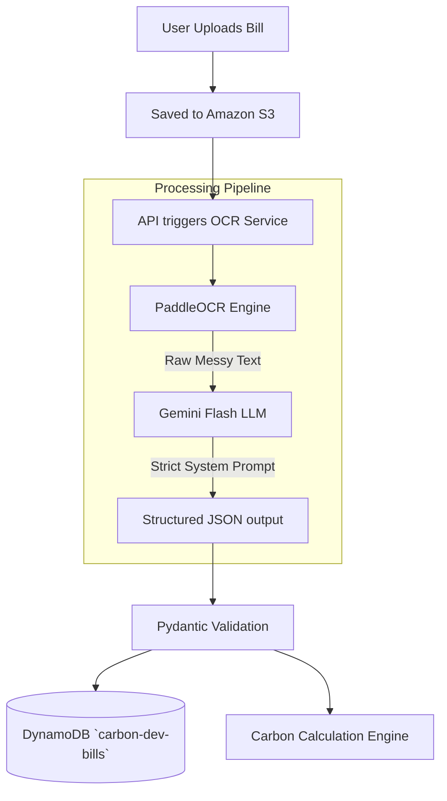

# Carbon-Auditor: OCR and Bill Processing

## 1. Purpose

This document details the On-Demand Bill Processing pipeline. It explains how raw utility bills (PDFs, Images) are ingested, processed using Optical Character Recognition (OCR), and structured into highly accurate JSON data using Large Language Models (LLMs).

## 2. Pipeline Overview

The pipeline utilizes a hybrid approach:
1.  **PaddleOCR**: Used for initial raw text extraction. It is robust for varied document layouts and tabular data often found in utility bills.
2.  **Gemini Flash**: Used as an advanced Document Understanding layer. It takes the messy raw text from PaddleOCR and structures it into a strict JSON schema.



## 3. Supported Formats

*   **Images**: PNG, JPEG, JPG (Processed directly by PaddleOCR).
*   **Documents**: PDF (Requires conversion to images via `pdf2image` library before passing to PaddleOCR).

## 4. Processing Steps

### 4.1. Image Processing
If a PDF is uploaded, the backend uses `pdf2image` to convert the first 2-3 pages (where billing summaries usually reside) into JPEGs. These images are temporarily stored in Lambda's `/tmp` directory.

### 4.2. OCR Execution (PaddleOCR)
PaddleOCR is initialized with English language support (`lang='en'`). It scans the image and outputs a list of detected text strings and their bounding boxes. The bounding boxes are currently ignored; all text strings are concatenated into a single large "raw text" document.

### 4.3. Document Understanding (Gemini Flash)
The raw text is passed to Gemini Flash. Gemini Flash is chosen because it is highly cost-effective, fast, and excellent at structuring text when given a strict schema.

#### Prompt Engineering
The system prompt is critical. It forces Gemini to act as a data parser, not a conversational agent.

```text
You are an automated data extraction tool.
Extract the following information from the provided raw utility bill text.
Respond ONLY with a valid JSON object matching this exact schema. Do not include markdown formatting or explanations.

Schema:
{
  "utility_type": "string (ELECTRICITY, NATURAL_GAS, or WATER)",
  "consumption": "number (total amount used)",
  "unit": "string (e.g., kWh, Therms, Gallons)",
  "cost": "number (total amount due in USD)",
  "billing_period_start": "YYYY-MM-DD",
  "billing_period_end": "YYYY-MM-DD"
}

Raw Text:
{raw_ocr_text}
```

## 5. Validation and Retries

*   **Pydantic Schema Validation**: The JSON output from Gemini is parsed into a Pydantic model (`ExtractedBillData`).
*   **Validation Rules**: `consumption` and `cost` must be floats > 0. `utility_type` must be an Enum.
*   **Retry Logic**: If Gemini outputs malformed JSON (e.g., forgets a comma, includes conversational text), the backend catches the JSONDecodeError or Pydantic ValidationError and retries the Gemini call with an appended warning: *"Your previous output was invalid JSON. Try again."* Max retries: 2.

## 6. OCR Confidence and Quality

*   If PaddleOCR extracts fewer than 20 words, the document is flagged as "Low Quality," and the pipeline is aborted early to save Gemini API costs. The status is set to `FAILED_OCR_QUALITY`.

## 7. Developer Notes
*   PaddleOCR binaries can be large. Ensure they fit within the AWS Lambda deployment package limits (250MB unzipped). You may need to use a Lambda Layer or deploy via a Docker container image to ECR if limits are exceeded.
*   Temporary files in `/tmp` must be explicitly deleted at the end of the Lambda invocation to prevent storage exhaustion in subsequent warm starts.
